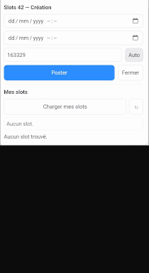

# 42 Slots — Extension Firefox Mobile

**42 Slots** est une extension open-source pour **Firefox (mobile)** permettant aux étudiants de l’école 42 de **créer, afficher et supprimer leurs slots** directement depuis la page officielle de l’intra (`https://profile.intra.42.fr/slots`).  
Elle a été conçue pour offrir une expérience fluide et mobile-friendly, sans avoir à naviguer dans l’interface complexe du site.



[▶️ Voir la démo vidéo](https://youtube.com/shorts/8dFg-4t0dqQ)

---

## 🚀 Fonctionnalités principales

- **Interface intégrée** sur la page des slots 42.
- **Création rapide** de slots avec vérification automatique des règles.
- **Affichage clair** de tous tes slots récents.
- **Suppression en un clic** des groupes de slots.
- **Auto-détection du user_id** depuis les cookies.
- **Mode sombre / clair** personnalisable et sauvegardé.
- **Aucune donnée externe** : tout fonctionne localement dans le navigateur.

---

## ⚙️ Installation

1. Télécharge la dernière version signée sur :  
   **[https://addons.mozilla.org/firefox/addon/42-slots/](https://addons.mozilla.org/firefox/addon/42-slots/)**

2. Une fois installée, rends-toi sur :  
   `https://profile.intra.42.fr/slots`

3. Un panneau “Slots 42 — Création” s’affichera en bas de l’écran.

---

## 🧩 Utilisation

1. Renseigne le **début** et la **fin** de ton slot.  
2. Clique sur **Auto** pour détecter ton `user_id`.  
3. Clique sur **Poster** → ton slot est créé.  
4. Clique sur **Charger mes slots** pour actualiser la liste.  
5. Supprime un slot via le bouton **Supprimer** (désactivé pour les slots réservés).

---

### ⚙️ Règles métier — Création et suppression de slots

Ces règles respectent les contraintes de l’intra 42 et sont appliquées **avant tout envoi au serveur**, pour éviter les erreurs et rejets côté backend :

#### 🧱 Création de slots
- **Durée minimale de 30 minutes** : empêche la création de slots trop courts.  
- **Début < Fin** : vérifie la cohérence temporelle avant soumission.  
- **Règle des quarts d’heure** : les horaires de début et de fin sont automatiquement arrondis au quart d’heure supérieur (`00`, `15`, `30`, `45`).  
- **Règle du décalage de 30 minutes** : un slot ne peut commencer qu’à partir de la *prochaine quinzaine strictement après maintenant + 30 minutes*.  
  *Exemples :*  
  - à 12h30 → début possible à 13h15  
  - à 15h12 → début possible à 15h45  
- **Protection anti-slot trop tôt** : si la date de début est avant la limite autorisée, le script bloque la création et affiche “Début trop tôt”.  
- **Durée maximale de 7 jours** : un slot (ou groupe créé en une seule requête) ne peut pas dépasser **7 jours** ; au-delà, la création est bloquée avec un message d’erreur.  
- **Protection contre les overlaps** : l’extension détecte et affiche clairement les conflits

#### 🗑️ Suppression de slots
- **Protection contre la suppression des slots réservés** : le bouton “Supprimer” est caché ou désactivé si le slot a le statut `reserved`.  

---

### 🔮 TODO (à venir)
- Vérifier la protection pour les slots reserved.
- Gérer la version desktop en plus du mobile.
- injecter/remplacer la page slot mobile directement.

---

## 🧱 Structure du projet
```
42_slots/
├── manifest.json # Manifest MV3 + compatibilité Android
├── content.js # Code principal de l’extension
├── icons/
│ ├── icon-48.png
│ └── icon-128.png
└── LICENSE # Licence MIT
```

---

## 🧮 Build manuel (.xpi)
```
source create_addon.sh
```

---

## 📜 Licence

Ce projet est distribué sous la **Licence MIT**.  
Tu es libre de l’utiliser, le modifier, le redistribuer ou le forker, tant que la licence et les droits d’auteur d’origine sont conservés.

---

## 💬 Support et contribution

- **Site du module :** [https://addons.mozilla.org/firefox/addon/42-slots/](https://addons.mozilla.org/firefox/addon/42-slots/)
- **Code source :** [https://github.com/JeanBaptisteDurand/Addon_42_slots_mobile_ez](https://github.com/JeanBaptisteDurand/Addon_42_slots_mobile_ez)
- **Contact :** jedurand@student.42perpignan.fr

Les contributions sont les bienvenues via *issues* et *pull requests*.

---

## ❤️ Remerciements

Merci à la communauté **42** pour les retours et suggestions.  
Ce projet a été créé pour simplifier la gestion des slots, surtout depuis mobile, tout en restant **100 % open source** et **sans collecte de données**.
